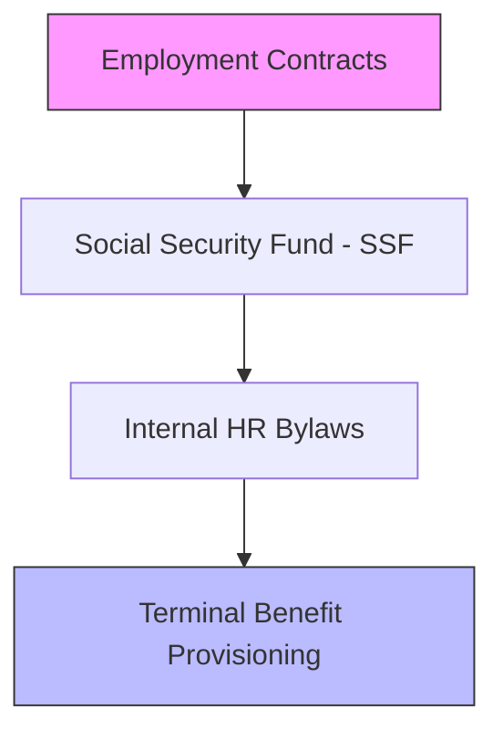

# Labor Act 2074: Strategic Employer Briefing

*In Nepal's regulatory environment, hiring is a commercial decision, but compliance is a survival requirement.*

<ReadTime />

The *Labor Act 2074* applies to **all entities** hiring even a single employee. Non-compliance can lead to irreversible labor litigation, heavy interest on unpaid benefits, and organizational paralysis.

---

## 🏗️ The Compliance Architecture
Every employer must institutionalize these four pillars of workforce management.

---

## 📝 1. Hiring & Statutory Contracts
You cannot hire "off the books". All employment must be formalized.
*   **Mandatory Contract**: Every employee (Regular, Task-based, or Casual) requires a written agreement.
*   **Probation Protocol**: Maximum **6 Months**. If not terminated in writing before the 6th month, the employee is deemed permanent.
*   **Outsourcing**: Only allowed for non-core activities (Cleaning, Security) through licensed providers.

---

## 💰 2. Remuneration & Benefits (2080/81)
The Minimum Wage is a floor, not a suggestion.

| Category | Basic Salary | Dearness Allowance | Total Minimum |
| :--- | :--- | :--- | :--- |
| **All Sectors** | NPR 10,820 | NPR 6,480 | **NPR 17,300** |

*   **Overtime**: Capped at 4 hours/day and 24 hours/week, paid at **1.5x** the ordinary rate.
*   **Festival Bonus**: Mandatory 1 month's salary (or pro-rata) disbursed after one year of service.

---

## 🛡️ 3. Social Security Fund (SSF) Mastery
Listing with SSF is the most critical compliance step for 2081/82.

*   **Employer Contribution**: 20% of Basic Salary.
*   **Employee Contribution**: 11% of Basic Salary.
*   **Total Deposit**: **31%** deposited by the 15th of every month.

> [!IMPORTANT]
> Failure to deposit SSF can make directors personally liable for employee medical and retirement claims.

---

## 🚫 4. Orderly Separation & Termination
Nepal is **not** an "at-will" employment market. You can only terminate under:
1.  **Poor Performance**: Requires two written warnings and a formal improvement period.
2.  **Misconduct**: Theft, violence, or continuous absence (requires a transparent inquiry).
3.  **Redundancy**: Due to financial restructuring (requires 30-day notice to the Labor Office).

---

## Deliverables for a Compliant Workplace
*   **Legally Vetted Contracts**: Protecting the employer's interests.
*   **HR Handbook**: Formalized internal bylaws approved by the Labor Office.
*   **Actuarial Valuation**: Provisioning for Gratuity and Leave as per *NAS 19*.

---

### Managing a Growing Team?
Don't let a labor dispute derail your growth.

[**Get an HR Compliance Audit →**](/contact)
