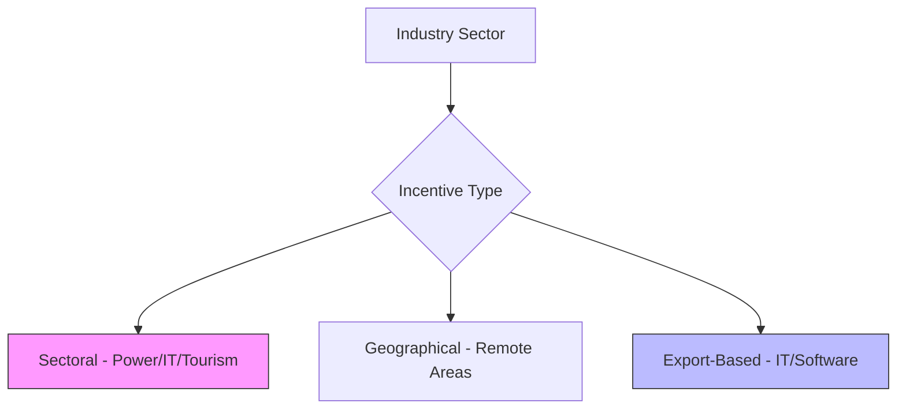

# Tax Holidays & Concessions: Strategic Briefing (FY 2081/82)

*In Nepal's industrial policy, choosing the right location and sector can reduce your effective tax rate from 25% to 0%.*

<ReadTime />

The Government of Nepal offers significant tax incentives to promote key sectors like Hydropower, IT, and Manufacturing. However, these incentives are discretionary and require strict adherence to the *Industrial Enterprises Act* and the *Income Tax Act 2058*.

---

## 🏗️ The Incentive Architecture
Tax holidays are generally categorized by **Sector** and **Geography**.

---

## ✈️ Key Sectoral Incentives

### ⚡ 1. Hydropower & Energy
Projects starting commercial operation before **Chaitra 2083**:
*   **First 10 Years**: **100% Tax Holiday**.
*   **Next 5 Years**: **50% Tax Exemption**.
*   *Applies to:* Generation, transmission, and distribution.

### 🏨 2. Tourism & Luxury Hotels
Hotels with investment exceeding NPR 1 Billion:
*   **First 5 Years**: **100% Tax Holiday**.
*   **Next 3 Years**: **50% Tax Exemption**.

### 💻 3. IT & Software Exports
*   **Export Income**: Effective tax rate of **1%** if paid in foreign currency.
*   **IT Parks**: 25% exemption for industries established within designated zones.

---

## 📍 Geographical Concessions
Industries (Manufacturing) in "Highly Undeveloped" and "Undeveloped" districts enjoy:
*   **100% Tax Exemption** for the first **10 Years**.
*   *Note:* Districts are classified (A to E) under the *Industrial Enterprises Act*.

---

## � Strategic Comparison Matrix
| Industry Type | Tax Holiday | Post-Holiday Rate | Mandatory Filings |
|:---|:---|:---|:---|
| Hydropower | 10 Years (100%) | 10% (5 Years) | D03 Annual |
| Manufacturing (Remote) | 10 Years (100%) | Full Rate | D03 Annual |
| IT Export | N/A | 1% (Continuous) | D01/D03 |
| Luxury Hotels | 5 Years (100%) | Half Rate (3 Years) | D03 Annual |

---

## ⚖️ Critical Compliance Rules
It is a common misconception that these holidays are automatic.
1.  **DOI Registration**: You must be registered as an "Industry" with the Department of Industry.
2.  **Audit Integrity**: Books must be audited in accordance with *NFRS*.
3.  **Active Filing**: You must still file a "D03" tax return annually and explicitly claim the exemption. Failure to file on time can lead to a loss of the exemption for that year.

---

### Eligible for a Tax Holiday?
Maximizing your incentives requires a combination of industrial and fiscal planning.

[**Get a Tax Planning Assessment →**](/contact)
