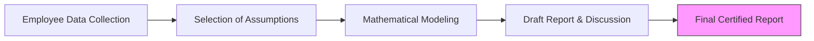

With the mandatory implementation of NFRS, companies can no longer provide "guestimates" for long-term employee liabilities. **Artha Advisory**, in collaboration with regional actuarial firms, provides certified reports that meet the rigorous standards of your auditors and the Tax Office.

## Why Actuarial Valuation?

1.  **Accounting Compliance (NAS 19/IAS 19):** Auditors require an independent actuarial report to validate the Gratuity and Leave Encashment provisions in your balance sheet.
2.  **Tax Deduction:** Contributions to an approved retirement fund are deductible only if supported by an actuarial certification.
3.  **Future Funding Clarity:** Understand exactly how much cash you need to set aside today to meet the retirement obligations of tomorrow.

## Our Core Actuarial Services

### 1. Employee Benefit Valuations
We calculate the Present Value of Defined Benefit Obligations (PVDBO) for:
*   **Gratuity Plans**: Both funded and unfunded.
*   **Leave Encashment**: Sick leave and Earned leave liabilities.
*   **Pension Schemes**: Specialized valuation for older institutions and NGOs.

### 2. Assumption Setting & Reporting
We help management set realistic demographic and financial assumptions:
*   **Discount Rates**: Based on the yield of Nepal Government bonds.
*   **Salary Growth Rates**: Tailored to your industry and historical trends.
*   **Attrition/Mortality Rates**: Using the latest Nepal Life Table (NLT) data.

### 3. Disclosure Notes for NFRS
We provide the complete **Disclosure Notes** required for your annual report, including Sensitivity Analysis (measuring how a 1% change in discount rate affects your liability).

---

## 📈 The Valuation Process

---

## Deliverables & Compliance
Each engagement concludes with a **Certified Actuarial Valuation Report** containing:
*   **Executive Summary**: High-level impact on Profit & Loss and Balance Sheet.
*   **Sensitivity Analysis**: Showing how changes in discount rates or salary growth affect the liability.
*   **Disclosure Notes**: Standardized text ready to be inserted directly into your financial statements.

::: tip Advisory
Are you transitioning to NFRS? Ensure your employee benefit provisions are mathematically sound and audit-ready. [Inquire About Valuation](/contact).
:::
