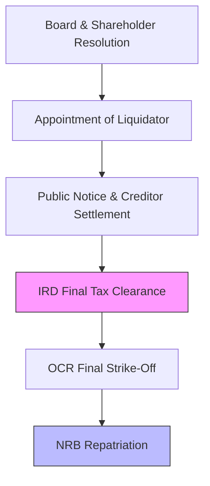

Closing a business in Nepal is often more complex than starting one. **Artha Advisory** specializes in the professional, compliant, and orderly liquidation of entities, ensuring that all legal, tax, and labor obligations are met before the final strike-off.

## Navigating the Exit

### 1. Voluntary Liquidation (Winding Up)
Assistance in the legal process under the *Companies Act*. We handle the appointment of liquidators, public notifications, and representation before the **Office of the Company Registrar (OCR)**.

### 2. Tax Clearance & Final Audit
The biggest hurdle to liquidation is obtaining the final **Tax Clearance Certificate**. We audit your historical records, resolve pending assessments, and liaison with the IRD to close your PAN/VAT folders permanently.

### 3. Asset Disposal & Repatriation
For foreign investors, we manage the sale/transfer of local assets and handle the complex **NRB Repatriation Approval** process to ensure your capital returns home safely.

---

## 🚩 The Liquidation Roadmap

---

## Delivering Peace of Mind
Our liquidation mandate ensures:
*   **Zero Tail Liability**: Ensuring all tax and labor obligations are formally cleared so directors are protected from future claims.
*   **Professional Documentation**: Drafting all necessary legal notices and reports required by the OCR.
*   **Asset Monetization**: Independent valuation and transparent sale processes for company assets.

---

## ⚖️ Governing Legislation
Our services are anchored in:
*   **Insolvency Act 2063**: Governing reorganization and liquidation.
*   **Companies Act 2063**: Voluntary winding-up procedures.
*   **Income Tax Act 2058**: Final tax clearance protocols.

::: tip Strategic Exit
Don't let a poorly managed closure lead to personal liability for directors. [Consult with Our Liquidation Experts](/contact).
:::
