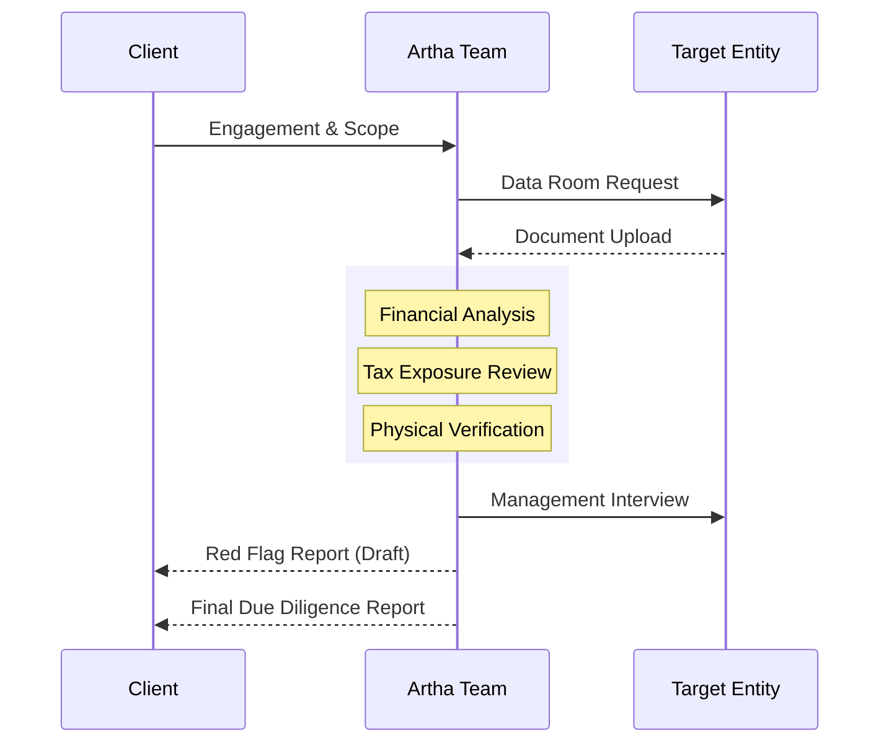

## Evidence-Based Decision Making
In the context of investments, joint ventures, or acquisitions, what you *don't* know is what costs you. **Artha Advisory** provides deep-dive Due Diligence (DD) that goes beneath the surface of financial statements to reveal the true health of a target entity.

Our goal is simple: to provide the **deal-making intelligence** needed to negotiate from a position of strength and avoid post-closure surprises.

---

## 🔍 The Artha DD Methodology

---

## Scope of Professional Diligence

### 1. Financial Due Diligence (FDD)
*   **Quality of Earnings (QoE)**: Normalizing EBITDA by removing one-time gains or non-recurring expenses.
*   **Working Capital Analysis**: Identifying seasonal fluctuations and "trapped" cash.
*   **Net Debt Calculation**: Uncovering off-balance sheet liabilities and hidden borrowings.

### 2. Tax Due Diligence (TDD)
*   **Unassessed Years**: Calculating the potential impact of pending IRD assessments.
*   **VAT & TDS Reconciliation**: Verifying that the target has properly remitted all fiduciary taxes.
*   **Deferred Tax Verification**: Assessing the legitimacy of tax loss carry-forwards.

### 3. Legal & Commercial DD
*   **Contract Review**: Identifying "Change of Control" clauses that could terminate key vendor agreements.
*   **Labor Compliance**: Verifying Social Security (SSF) and Gratuity funding—often a major hidden cost.

---

## Delivering Technical Clarity
Our DD process culminates in:
*   **The "Red Flag" Report**: An immediate summary of deal-breakers identified within the first 72 hours.
*   **The Full DD Report**: A detailed dossier suitable for presentation to Investment Committees and Banks.
*   **Valuation Adjustments**: Quantitative evidence to support a reduction in purchase price or escrow requirements.

[**Inquire About Due Diligence**](/contact)
