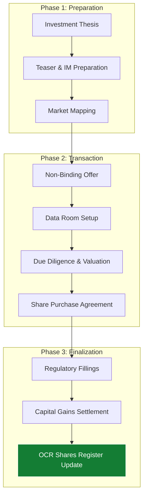

M&A in Nepal requires a unique blend of global financial modeling and deep local regulatory expertise. **Artha Advisory** acts as your lead advisor through the entire transaction lifecycle, helping you navigate the complexities of the DOI, OCR, and the *Competition Act*.

---

## 🏗️ Transaction Lifecycle Architecture

Our M&A methodology ensures that strategic intent translates into financial value while mitigating regulatory risk.

---

## Transaction Lifecycle Support

### 1. Buy-Side & Sell-Side Advisory
Whether you are an institutional investor seeking entry into the Nepal market or a local founder looking for an exit, we manage the entire process:
*   **Target Search & Origination**: Identifying off-market opportunities.
*   **Information Memorandum (IM)**: Preparing professional profiles for target entities.
*   **Negotiation Strategy**: Structuring earn-outs, escrows, and representations & warranties.

### 2. Valuation & Deal Structuring
Using DCF (Discounted Cash Flow) and Market Multiples to arrive at a fair equity value. We advise on tax-efficient structures (Slump Sale vs. Share Transfer) to maximize net proceeds.

### 3. Regulatory Approvals & Liaison
Coordinating the trilateral approval process for M&A:
*   **Department of Industries (DOI)**: For foreign investment changes.
*   **Inland Revenue Department (IRD)**: For Capital Gains Tax (CGT) assessment.
*   **Office of Company Registrar (OCR)**: For updating share registers.

---

## Post-Merger Integration (PMI)
The deal doesn't end at closing. We help you harmonize:
*   **Financial Reporting**: Merging charts of accounts and reporting standards.
*   **Compliance Frameworks**: Standardizing tax and labor practices across the new entity.
*   **Technology Stacks**: Integrating ERP and payroll systems.

---

## Key Service Deliverables
Under our Advisory mandate, clients receive:
1.  **Detailed Valuation Report**: Professionally drafted and ready for Board review.
2.  **Due Diligence Dossier**: A comprehensive analysis of the target's financial health.
3.  **Transaction Support**: Assistance in drafting and vetting Share Purchase Agreements (SPA).
4.  **Integration Roadmap**: A 100-day plan to harmonize operations post-closure.

::: tip Strategic Growth
Are you looking to expand through acquisition or merge with a strategic partner? [Start Your Acquisition Strategy Today](/contact).
:::
