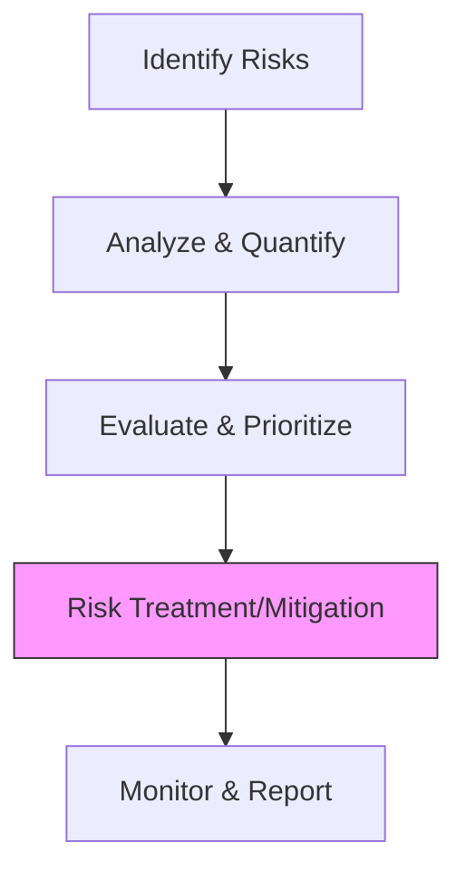

Risk is inherent in business, but in Nepal's volatile regulatory and economic landscape, it must be managed with precision. **Artha Advisory** helps you move from reactive "firefighting" to a proactive **Enterprise Risk Management (ERM)** framework that protects your long-term value.

## Our Risk Advisory Portfolio

### 1. Regulatory Risk & Compliance
Audit of your organization against critical laws: *Companies Act, Labor Act, Bonus Act, and Social Security Act*. We provide a **Compliance Dashboard** to ensure zero-penalty operations.

### 2. Internal Financial Controls (IFC)
Reviewing your "Order to Cash", "Procure to Pay", and "Payroll" cycles to minimize leakages, fraud, and material misstatements in financial reporting.

### 3. Business Continuity Planning (BCP)
Developing strategies to keep your business running during external shocks, from political instability and natural disasters to cyber-attacks and supply chain disruptions.

---

## 🛡️ The ERM Framework

---

## Clear Deliverables
Our Risk Management mandate provides:
*   **Risk Heat Map**: A visual prioritization of threats to your business.
*   **Control Gap Analysis**: Identification of "broken" processes with clear remediation steps.
*   **Standard Operating Procedures (SOPs)**: Formalizing workflows to ensure accountability.
*   **Compliance Dashboard**: A monitoring tool for management and the Audit Committee.

---

## ⚖️ Standards & Compliance
Our methodology is anchored in:
*   **ISO 31000**: Risk Management guidelines.
*   **COSO Framework**: Internal Control - Integrated Framework.
*   **Nepal Rastra Bank IT Guidelines**: For BFIs and Fintech entities.

::: tip Protect Your Value
A single control failure can cost more than a decade of advisory. [Schedule a Risk Workshop with Our Experts](/contact).
:::
