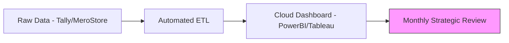

In a growing enterprise, there comes a point where a "Senior Accountant" is no longer enough. You need strategic financial leadership to manage cash flows, advise on fundraising, and institutionalize controls. **Artha Advisory's Virtual CFO** service provides this expertise on a part-time or project basis, tailored to your scale.

## The CFO's Toolkit

### 1. Financial Planning & Analysis (FP&A)
We don't just record history; we help you write the future.
*   **Budgeting & Forecasting**: 3-year financial models to guide growth.
*   **Burn Rate Analysis**: Critical for startups managing investor capital.
*   **Profitability by Segment**: Identifying which products/branches are truly making money.

### 2. Strategic Support
*   **Fundraising Assistance**: Preparing pitch decks, financial DD folders, and attending investor meetings.
*   **Exit Planning**: Grooming the company's financials for a potential sale or M&A.
*   **Bank Liaison**: Negotiating interest rates and credit limits with commercial banks.

### 3. Board Reporting & Governance
We serve as the bridge between management and the Board. We prepare professional **Board Decks** that provide clarity on financial health, regulatory risks, and strategic KPIs.

---

## 📊 Modern Finance Stack

---

## Why Virtual CFO?
*   **Cost Efficiency**: Access to partner-level expertise at a fraction of the cost of a full-time executive.
*   **Unbiased Advice**: An independent perspective on business performance, free from internal office politics.
*   **Immediate Scalability**: Ramp up our involvement during an acquisition or audit month, and scale down during "business as usual."

### Operational Intelligence (MIS)
*   **Executive Dashboards**: Monthly tracking of Gross Margins, Burn Rate, CAC, and LTV.
*   **Variance Analysis**: Identifying why actuals deviated from the plan and recommending course corrections.
*   **Cash Flow Management**: 13-week cash visibility to manage procurement and payables.

---

## 🏗️ vCFO Implementation Roadmap
1.  **Diagnostic (Month 1)**: Cleaning up historical data and implementing a professional Chart of Accounts.
2.  **Stabilization (Month 2)**: Establishing the monthly MIS cycle and basic cash controls.
3.  **Growth (Ongoing)**: Monthly strategy reviews, SOP design, and cost-optimization projects.

::: tip Scale Smart
Transition from a "proprietorship mindset" to a corporate powerhouse with professional financial leadership. [Talk to a Virtual CFO Expert](/contact).
:::
