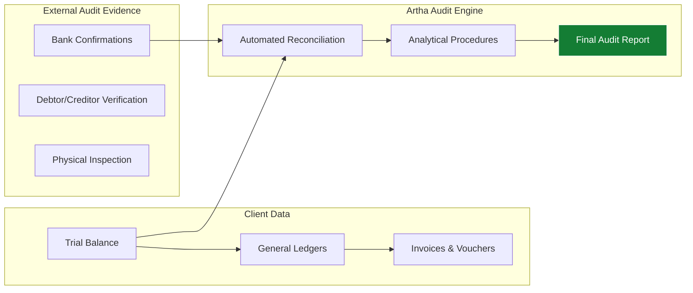

## Value-Driven Assurance
Artha Advisory moves beyond the traditional "tick-box" approach to audit. We view the audit process as a diagnostic tool—an opportunity to stress-test your business controls, identify operational leakage, and provide **actionable intelligence** that strengthens your organization.

Our methodology is risk-based, technology-driven, and strictly aligned with *International Standards on Auditing (ISA)* and *Nepal Standards on Auditing (NSA)*.

---

## 🏗️ Technical Audit Framework

We follow a trilateral verification process to ensure absolute data integrity.

---

## 🔍 Core Assurance Pillars

### 1. Statutory & NFRS Audit
Annual financial statement audit as per the *Companies Act 2063*. We specialize in transitioning companies to **Nepal Financial Reporting Standards (NFRS)** to meet global investment requirements.

### 2. Internal Audit & Risk Advisory
Reviewing procurement, sales, and HR cycles to detect inefficiencies. We design and test **Internal Financial Controls (IFC)**, ensuring your board is protected against material misstatements.

### 3. Digital Assurance (IS Audit)
Mandatory for BFIs and Fintech. We audit IT infrastructure against *NRB IT Guidelines* and perform **Cyber Security Reviews** to protect your digital assets.

---

## Specialized Forensic Support
When the numbers don't add up, our forensic team provides:
*   **Fraud Detection**: Investigating embezzlement and financial statement manipulation.
*   **Whistleblower Verification**: Independently auditing claims made through confidential channels.
*   **Litigation Support**: Providing expert financial testimony in arbitration and revenue tribunals.

---

## Audit Readiness Checklist
To ensure an efficient and high-value audit, have these ready:
1.  **Trial Balance**: Finalized up to Ashad end.
2.  **Confirmations**: Balance letters from Debtors/Creditors.
3.  **Fixed Asset Register**: With physical verification proof.
3.  **Fixed Asset Register**: With physical verification proof.
4.  **TDS / VAT Reconciliation**: Proof of trilateral agreement between books, returns, and payments.

---

## Explore Audit Services
<ServiceList category="Audit & Assurance" />

