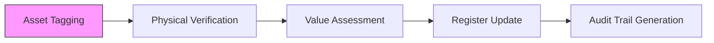

For large corporations and factories, manual asset tracking is a nightmare. **Artha Advisory** provides a modern, technology-driven approach to **Fixed Asset Management (FAM)**, ensuring your physical footprint matches your financial reporting.

## The Artha FAM Solution

### 1. Physical Verification & Tagging
Our field teams perform wall-to-wall physical verification of your assets across all locations. We use **QR/Barcoded Tags** to ensure each asset has a unique, digital identity linked to your ERP.

### 2. Asset Register Reconstruction
Is your Fixed Asset Register (FAR) a messy spreadsheet? We rebuild it from scratch, ensuring compliance with **NAS 16 (Property, Plant, and Equipment)**, including accurate calculation of depreciation and impairment.

### 3. Reconciliation & Audit Support
We perform the trilateral reconciliation between:
1.  Physical Reality (What's on the floor)
2.  Legal Records (Purchase bills/contracts)
3.  Accounting Ledgers (Financial books)

---

## 🏭 Operational Lifecycle

---

## Why Artha for Asset Management?
*   **Risk Reduction**: Preventing internal theft and operational loss through strict custodial accountability.
*   **Insurance Optimization**: Providing documented evidence for insurance valuation and claims.
*   **Audit Readiness**: Ensuring your next statutory audit passes with zero "Asset Discrepancy" qualifications.

## ⚖️ Compliance Standards
Our asset management services are anchored in:
*   **NAS 16 / IAS 16**: Property, Plant, and Equipment.
*   **Income Tax Act**: Section 19 & Schedule 2 (Depreciation rules).

::: tip Expert Insight
Don't guess the value of your infrastructure. Get a professional verification and digital asset register. [Inquire About Asset Tagging](/contact).
:::
