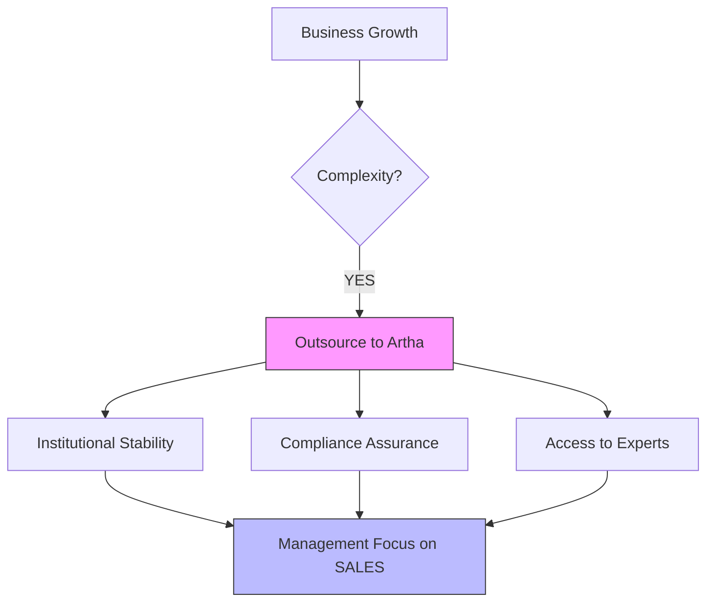

Scaling a business requires focus. By outsourcing your complex back-office functions to **Artha Advisory**, you gain the stability of a professional finance team without the overhead of internal management. We provide the "Financial Engine" that powers your growth.

## Our Outsourcing Pillars

### 1. Managed Accounting
Full-stack bookkeeping, monthly reconciliations, and the production of investor-ready management accounts (MIS). We move your finance function to the cloud for real-time visibility.

### 2. Payroll & HR Administration
From calculating SSF/TDS for hundreds of employees to managing confidential executive payroll, we ensure your team is paid accurately and on time, every month.

### 3. Fixed Asset Management (FAM)
End-to-end asset tracking, from physical tagging and periodic verification to maintaining audit-compliant asset registers.

---

## 📈 The Outsourcing Value Prop

---

## Why Outsource with Artha?
*   **Zero Person-Risk**: Never worry about your accountant or payroll manager resigning. Our team-based model ensures continuity.
*   **Cost Efficiency**: Replace high fixed salary costs with a flexible, result-oriented service fee.
*   **Integrity & Controls**: We implement strict segregation of duties, significantly reducing the risk of internal fraud or leakage.

## Driving Efficiency Through Process
Modern growth requires a lean, process-driven backend. Artha Advisory's **Financial Outsourcing** division helps businesses eliminate administrative bottlenecks, reduce overhead, and institutionalize financial controls.

Whether you need a dedicated **Payroll** engine, professional **Fixed Asset Management**, or a complete **Managed Accounting** department, our team delivers high-precision results backed by technical expertise and modern technology.

---

## 🚀 Managed Finance Solutions

### 1. Managed Accounting & vCFO
Full-stack bookkeeping and strategic financial leadership using cloud-native tools. We provide the "Financial Visibility" needed to make executive decisions with confidence.

### 2. Payroll & HR Operations
High-precision payroll processing with 100% compliance with the *Labor Act 2074* and Social Security (SSF) requirements.

### 3. SOP Design & Process Engineering
Transitioning your business from person-dependent to **process-driven** through documented workflows for every key department.

### 4. Fixed Asset Management
End-to-end asset lifecycle management, including professional tagging, physical verification, and NFRS-compliant depreciation modeling.

---

## Our Methodology
We follow a cycle of continuous improvement and rigorous verification.

---

### Ready to Optimize Your Backend?
Outsource the complexity. Focus on the commercial strategy.

[**Get an Operational Assessment**](/contact)

---

## Explore Outsourcing Services
<ServiceList category="Financial Outsourcing & Managed CFO" />
