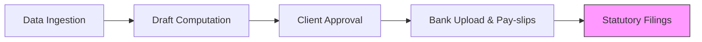

Managing payroll in Nepal is no longer just about cutting checks. With the mandatory implementation of the **Social Security Fund (SSF)** and increasing IRD scrutiny on TDS, compliance is critical. **Artha Advisory** manages your entire payroll cycle, accurately, confidentially, and on time.

## Our Payroll Mandate

### 1. Monthly Payroll Processing
We calculate gross to net pay, factoring in:
*   Statutory TDS (Tax Deductible at Source) as per latest slabs.
*   Employee and Employer **SSF Contributions (11% + 20%)**. Use our **[SSF Contribution Calculator](/resources/tools/calculators)** for simulations.
*   Overtime (OT) and Bonus calculations as per the *Labor Act*.

### 2. Statutory Filings & Payments
We handle the administrative burden of:
*   Preparing and uploading e-TDS returns to the IRD portal.
*   E-filing monthly SSF schedules.
*   Managing **Gratuity & Leave** provisions as per actuarial norms.

### 3. Confidential Executive Payroll
A specialized service for senior management and expatriates where payroll data is handled directly by our partners, ensuring absolute confidentiality within your organization.

---

## 🕒 The Monthly Payroll Cycle

---

## ⚖️ Regulatory Governance
Our payroll engine is strictly aligned with:
*   **Labor Act 2074**: Minimum wage, OT, and terminal benefit rules.
*   **Income Tax Act 2058**: Current tax slabs and rebate rules for residents/non-residents.
*   **Bonus Act**: Computation and distribution of statutory bonuses.

::: tip Efficiency
Eliminate the administrative burden and technical risk of in-house payroll. [Get a Quote for Managed Payroll](/contact).
:::
