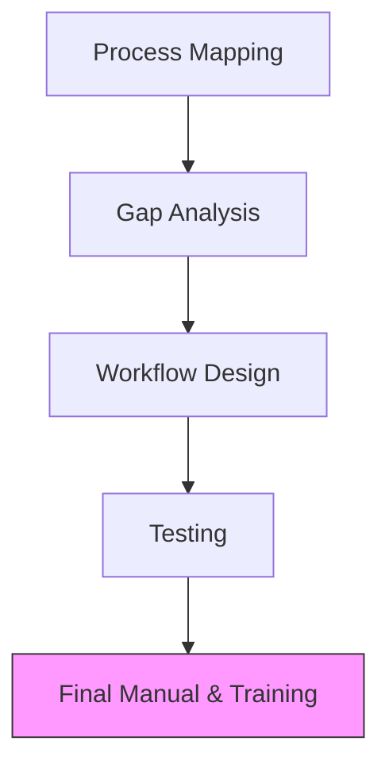

Documented processes are the backbone of a scalable business. **Artha Advisory** helps you institutionalize knowledge and reduce person-dependency by designing and implementing custom **Standard Operating Procedures (SOPs)** that bridge the gap between "how things are done" and "how they *should* be done."

## Our SOP Design Portfolio

### 1. Finance & Accounts SOPs
Documenting the "Order to Cash", "Procure to Pay", and "Inventory Management" cycles. We implement **Delegation of Authority (DoA)** matrixes to clarify approval hierarchies.

### 2. HR & Compliance SOPs
From "Onboarding to Offboarding" workflows to "Expense Reimbursement" policies. We ensure your internal rules are aligned with the *Nepal Labor Law*.

### 3. Procurement & Supply Chain
Establishing strict vendor selection criteria, purchase order (PO) workflows, and "Three-Way Matching" to eliminate procurement leakage and fraud.

---

## ⚙️ The SOP Architecture

---

## Why SOPs Matter for Business Leaders
*   **Auditability**: Makes your business "audit-ready" for both statutory and donor audits.
*   **Scalability**: Allows you to replicate your business in new locations with minimal friction.
*   **Fraud Protection**: Distributes authority so no single individual can bypass controls.

::: tip Scale Smart
Stop relying on memory. Start relying on professional processes that protect your value. [Standardize Your Operations Today](/contact).
:::
