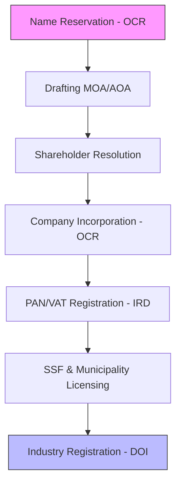

## Business Entry Strategy
Choosing the right legal structure is the most critical decision for any new venture in Nepal. Whether you are a local entrepreneur setting up a **Private Limited Company** or an international corporation seeking **FDI Approval**, Artha Advisory ensures your entry is legally sound and tax-efficient.

We navigate the bureaucratic maze of the *Office of the Company Registrar (OCR)* and the *Department of Industry (DOI)* so you can focus on building your business.

---

## 🏗️ The Registration Path
We manage the entire lifecycle from name reservation to operational licensing.

---

## Our Corporate Formation Services

### 1. Domestic Incorporation
*   **Private Limited Company**: Ideal for SMEs and startups.
*   **Public Limited Company**: Required for BFIs, Insurance, and companies planning an IPO.
*   **Non-Profit Companies**: Registration under the *Companies Act* for charitable or social objectives.

### 2. Foreign Investment (FDI)
*   **DOI Approval**: Securing investment approval under the *FITTA 2075*.
*   **NRB Capital Inflow**: Facilitating the mandatory bank account opening and capital injection protocols.
*   **Joint Ventures**: Drafting and vetting Shareholder Agreements (SHA) and Joint Venture Agreements (JVA).

### 3. Post-Registration Compliance
*   **Local Business License**: Registration with the relevant Metropolitan or Ward office.
*   **Social Security Fund (SSF)**: Mandatory registrations for employee welfare compliance.

---

## The Artha Advantage: Timeline & Certainty
| Milestone | Standard Duration |
|:---|:---|
| Name Approval | 24–48 Hours |
| OCR Incorporation | 3–5 Working Days |
| PAN/VAT Issuance | 1–2 Working Days |
| **Total Entry Time** | **~10–14 Days** |

---

## ⚖️ Legal Framework
Our registration advisory is anchored in:
*   **Companies Act 2063**: The primary legislation for all corporate entities.
*   **Industrial Enterprises Act**: Governing the registration and facilities of industries.
*   **Foreign Investment and Technology Transfer Act (FITTA) 2075**: For international capital.

