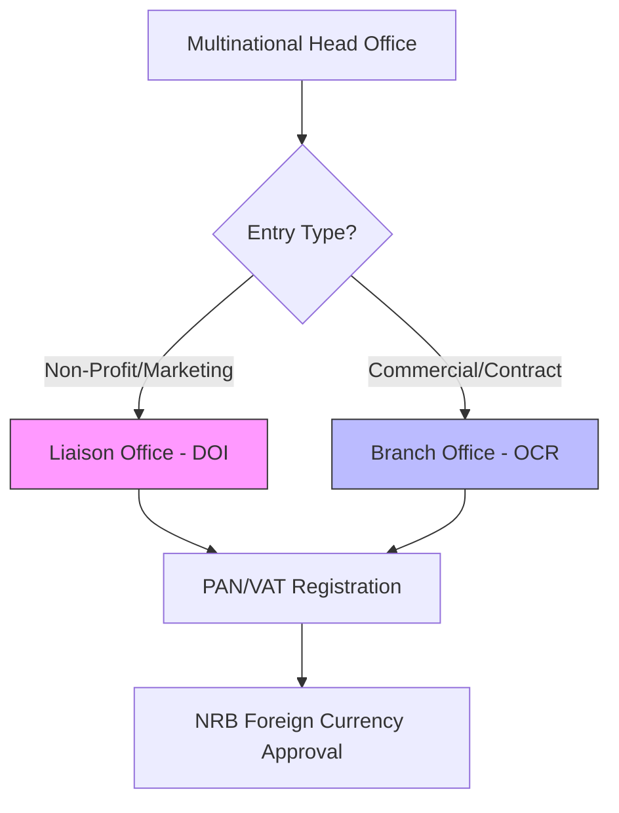

For many global entities, a full-scale subsidiary isn't the immediate goal. Whether you need a **Liaison Office** to represent your brand or a **Branch Office** to execute specific contracts, **Artha Advisory** provides the regulatory roadmap for your entry.

## Entry Options for Multinationals

### 1. Liaison Office (Representative Office)
Ideal for market research, coordination, and brand promotion. 
- **Note**: Liaison offices cannot engage in any revenue-generating activities in Nepal.
- **Registration**: Primarily handled through the **Department of Industry (DOI)**.

### 2. Branch Office
Ideal for executing specific projects or contracts.
- **Note**: Branch offices *can* generate revenue but are subject to strict tax and repatriation rules.
- **Registration**: Registered at the **Office of Company Registrar (OCR)** as a foreign company branch.

### 3. Compliance & Reporting
Foreign entities are subject to higher compliance transparency. We handle the annual audits, **Section 63/108 filings**, and mandatory tax reporting required to maintain your legal status.

---

## 🏛️ Regulatory Interface

---

## ⚖️ Regulatory Constraints
We ensure your office operates strictly within the boundaries of:
*   **Industrial Enterprises Act**: Defines the allowed contact activities.
*   **Income Tax Act 2058**: Governing the reporting of foreign-sourced funds and local expense TDS.

::: tip Planning Entry?
Establish your presence in Nepal with a legally compliant and professionally managed Liaison Office. [Consult our Foreign Investment Desk](/contact).
:::
