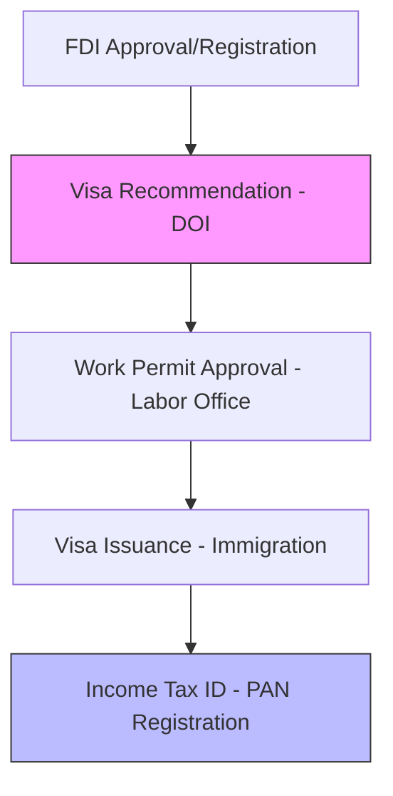

Attracting global talent and investment requires a smooth immigration path. **Artha Advisory** manages the entire administrative chain for your international team, ensuring that work permits and business visas are processed accurately and in full compliance with the *Immigration Act* and *Labor Act*.

## Immigration Solutions

### 1. Business Visa Support
For international investors and their representatives. We handle the application process at the **Department of Industry (DOI)** and the **Department of Immigration**, ensuring your residency is secured.

### 2. Work Permit Processing (Expatriates)
For technical and managerial talent. We liaison with the **Department of Labor** to secure work permits, justifying the "technical need" for foreign talent and managing the required advertisements.

### 3. Family & Residential Visas
Support for the dependants of primary visa holders, ensuring that your team's families are also fully documented and legally compliant.

---

## 📂 The Approval Lifecycle

---

## Why Outsource Mobility to Artha?
- **Timeline Efficiency**: Reducing the administrative burden on your HR department from weeks to days.
- **Risk Mitigation**: Preventing overstays and unauthorized employment which can lead to company blacklisting.
- **Compliance Oversight**: Ensuring all expatriates are registered with the Tax Office and SSF.

::: tip Global Mobility
Our mobility experts handle the bureaucracy so your team can focus on their mission. Deploy your global experts with confidence. [Inquire About Immigration Support](/contact).
:::
