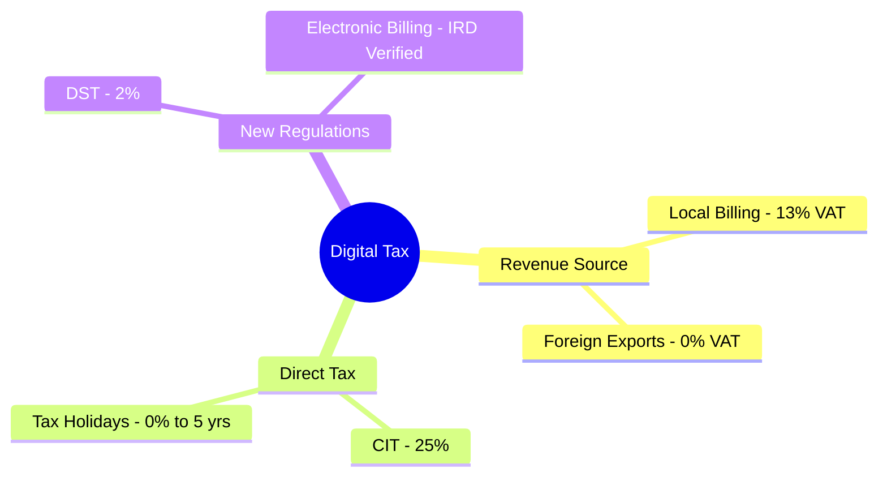

The digital economy is moving faster than legislation. From **Digital Service Tax (DST)** on global platforms to the complex tax treatment of SaaS exports from Nepal, Artha Advisory provides the technical clarity your tech business needs.

## Specialized Advisory for Tech

### 1. Digital Service Tax (DST) Compliance
Assistance for foreign platform providers in registering and filing DST as per the *Finance Act*. We handle the trilateral relationship between the provider, IRD, and local payment gateways.

### 2. SaaS & IT Export Incentives
Leveraging Section 11 of the *Income Tax Act* to maximize tax holidays for tech startups and ensuring 0% VAT on service exports through proper documentation (FIRC/Swift Advice).

### 3. Payroll for Remote Teams
Structuring compliant payroll and social security for companies hiring remote talent in Nepal, including **Social Security Fund (SSF)** registration for outsourced engineering teams.

---

## 🌐 The Digital Tax Map

---

## Bridging the Gap: Tech + Tax
We don't just speak tax; we understand your stack. Our team helps you integrate **Electronic Billing (E-Billing)** directly into your billing engine to ensure real-time compliance with IRD's APIs.
