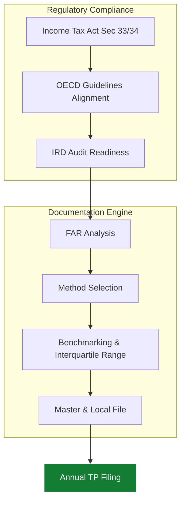
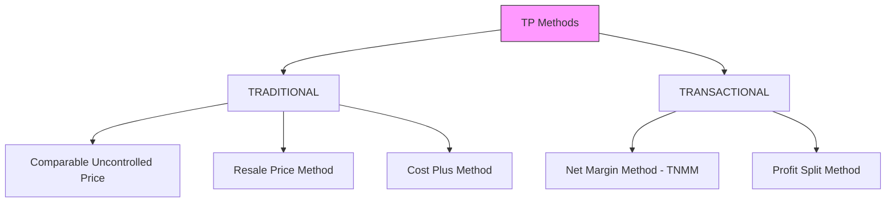

As multinational corporations scale in Nepal, intra-group transactions are under increasing scrutiny from the Inland Revenue Department (IRD). **Artha Advisory** helps you navigate Section 33 and 34 of the *Income Tax Act*, ensuring your global operations remain compliant with local arm's length principles.

---

## 🏗️ TP Compliance Framework

We use a risk-based approach to ensure that your intra-group pricing withstands regulatory stress tests.

---

## Specialized TP Services

### 1. Benchmarking & Comparability Analysis
Using local and regional databases to identify comparable uncontrolled prices (CUP) and ensure your pricing reflects the economic reality of the Nepal market.

### 2. TP Documentation (Master File & Local File)
Assistance in maintaining the robust documentation required by the Tax Office, justifying the pricing of Management Fees, Technical Royalties, and Intra-group loans.

### 3. Audit Defense & Representation
Defending your transfer pricing methodology during tax audits. We help provide technical justification for "Benefit Tests" for services received from parent companies.

---

## ⚖️ Pricing Methodologies

---

## Why TP Compliance Matters
*   **Avoid Double Taxation:** Improper pricing can lead to tax adjustments in Nepal while tax has already been paid in the parent country.
*   **Mitigate Penalities:** Section 117-120 penalties for "tax avoidance" schemes can exceed the tax amount itself.
*   **Operational Smoothness:** Compliant TP documentation ensures smoother repatriation of royalties and dividends.

::: tip Global Standards
Does your group follow OECD or UN Transfer Pricing guidelines? We harmonize global policies with Nepal's specific tax requirements. [Discuss Your TP Strategy](/contact).
:::
